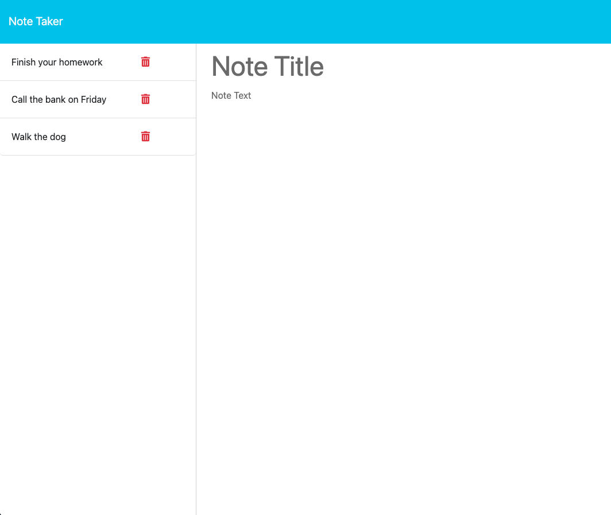

# Note Taker Starter Code

## Description

This is a website that allows users to create and delete notes. The notes are saved to a database that can be accessed from anywhere by returning to the site.

## Table of Contents

- [Installation](#installation)
- [Usage](#usage)
- [Contributing](#contributing)
- [License](#license)
- [Tests](#tests)
- [Questions](#questions)

## Installation

No installation is necessary, simply visit yyy.com on any device with internet access.

## Usage

To access this website vist yyy.com.
To add a note type over "Note Title" and "Note Text" then click the "Save Note" button in the top right.
To delete a note click the red trashcan next to the Note Title on the left side.
To view a note click on the Note Title on the left side.
To clear a not you are creating click the "Clear Form" button in the top right while you are actively typing a note.

## License

This project is licensed under the terms of the MIT license. See the badge at the top of the README for more details.

## Contributing

Additional Contributors: The majority of the code was created by UT Coding Bootcamp. I created the server.js, cleaned up the code, and finalized/customized the application.
3rd Party Assets: None.
Tutorials: ChatGPT was used for troubleshooting.

## Tests

None.

## Questions

Feel free to reach out to me with any additional questions through the following methods:\n
Github Profile: https://github.com/JesseDenier
Email Address: jessecdenier@gmail.com
